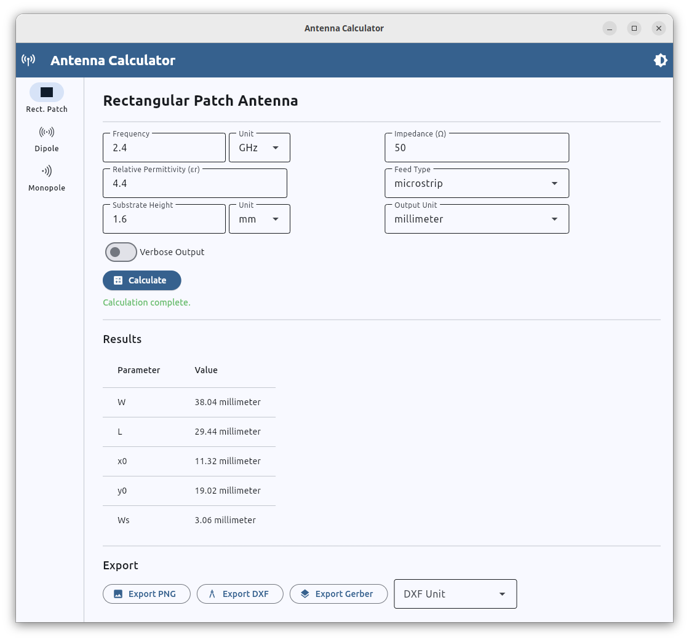
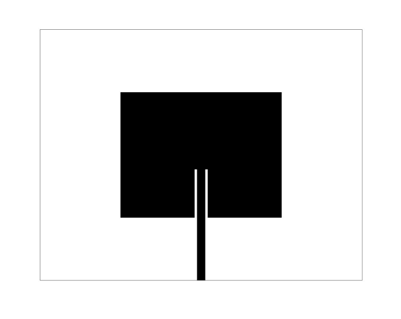
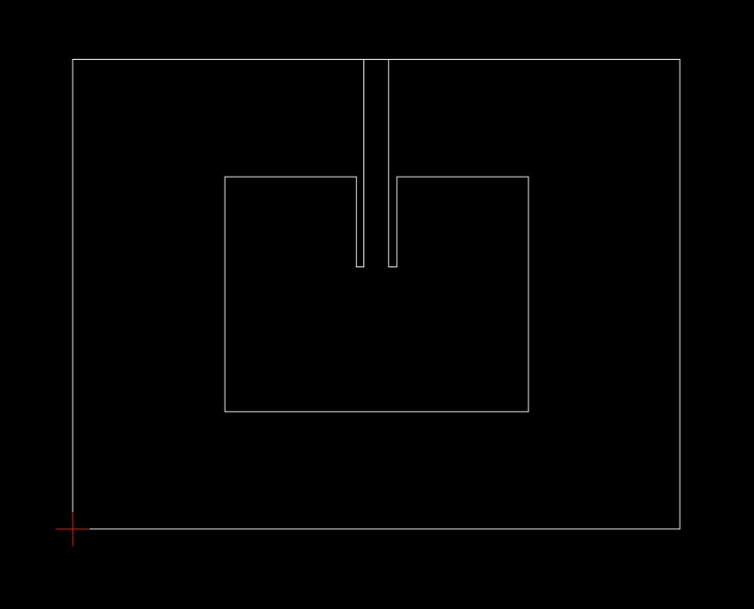
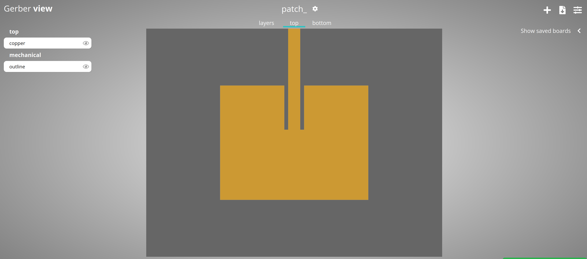

# AntennaCalculator

[](https://github.com/Dollarhyde/AntennaCalculator/blob/main/LICENSE)
[](https://www.python.org/downloads/)
[](https://github.com/Dollarhyde/AntennaCalculator/actions/workflows/tests.yml)
[](https://github.com/Dollarhyde/AntennaCalculator/actions/workflows/lint.yml)
[](https://github.com/Dollarhyde/AntennaCalculator/actions/workflows/security.yml)
[](https://doi.org/10.5281/zenodo.18603940)


AntennaCalculator is an open-source antenna design tool that computes physical dimensions for rectangular patch, half-wave dipole, and quarter-wave monopole antennas using analytical models [1]. It provides both a command-line interface and a cross-platform desktop GUI. For rectangular patch antennas, designs can be exported directly to fabrication-ready formats including Gerber, DXF, and PNG.

The calculated designs have been verified through simulation in Ansys HFSS and through physical experimentation.

## Statement of Need

Antenna design typically requires either expensive commercial electromagnetic simulation tools such as Ansys HFSS or CST Studio Suite, or manual calculations from textbook formulas. Online patch antenna calculators exist, but they only output basic width and length dimensions. They do not compute the 50-ohm impedance match feed point location or the microstrip feed line width, which are necessary to actually connect and use the antenna. There is no existing open-source tool that combines complete analytical antenna design calculations with direct export to PCB fabrication formats.

AntennaCalculator computes all parameters needed to build a working antenna from a set of input specifications: operating frequency, substrate permittivity, substrate height, and target impedance. For rectangular patch antennas, this includes the feed point location for both probe-fed and microstrip-fed configurations. The tool then exports the complete design in formats matched to different fabrication methods: PNG images for copper tape tracing or chemical etching, DXF files for CNC milling, and Gerber files for professional PCB manufacturing. References [2] and [3] walk through these fabrication methods and their use in engineering education.

The main contributions of AntennaCalculator are: (1) complete analytical antenna dimension calculations including impedance-matched feed point parameters; (2) direct export to multiple fabrication formats (PNG, DXF, Gerber), each supporting a different manufacturing method from low-cost copper tape to professional PCB production; (3) lowering the barrier to entry for antenna design in education and research by reducing the prerequisite knowledge needed to design and build a working antenna; and (4) both a CLI for scripting and automation, and a cross-platform desktop GUI for interactive use.

## Table of Contents

* [Installation](#installation)
* [GUI Application](#gui-application)
    * [Running the GUI](#running-the-gui)
    * [Building Desktop Applications](#building-desktop-applications)
* [CLI Usage](#cli-usage)
    * [Rectangular Patch Usage](#rectangular-patch-usage)
    * [Half Wave Dipole Usage](#half-wave-dipole-usage)
    * [Quarter Wave Monopole Usage](#quarter-wave-monopole-usage)
* [Examples](#examples)
    * [Rectangular Patch](#rectangular-patch)
      * [PNG output using `--pngoutput`](#png-output-using---pngoutput)
      * [DXF output using `--dxfoutput`](#dxf-output-using---dxfoutput)
      * [Gerber output using `--gerberoutput`](#gerber-output-using---gerberoutput)
* [References](#references)
* [Publications and Presentations](#publications-and-presentations)
* [Contributing](#contributing)
* [Citation](#citation)
* [License](#license)

## Installation

AntennaCalculator is a pure Python tool with no compiled extensions or platform-specific dependencies. It requires Python 3.10 or later and has been tested on Python 3.10, 3.11, 3.12, and 3.13.

Clone the repository and install the dependencies:

```
git clone https://github.com/Dollarhyde/AntennaCalculator.git
cd AntennaCalculator
pip install -r requirements.txt
```

AntennaCalculator can be run in two ways: the [GUI](#gui-application) for interactive design, or the [CLI](#cli-usage) for scripting and automation.

To verify everything is working, navigate to the `src/` directory and try a quick rectangular patch calculation:

```
cd src
python antenna_calculator.py rectangular_patch -f 2.4e9 -er 4.4 -h 1.6e-3
```

This computes the dimensions for a 2.4 GHz patch antenna on FR-4 substrate (εr = 4.4, height = 1.6 mm). 

## GUI Application

### Running the GUI

From the `src/` directory:
```
python gui.py
```

The GUI provides input fields for frequency, substrate properties, and impedance, with a results table and verbose console output. Use the navigation rail on the left to switch between the three antenna types. For rectangular patch designs, the export buttons save directly to PNG, DXF, or Gerber formats.



### Building Desktop Applications

Use `flet build` to package the application as a standalone desktop executable for distribution. No Python installation is required on the target machine.

**Build for Windows:**
```
flet build windows
```

**Build for Linux:**
```
flet build linux
```

**Build for macOS:**
```
flet build macos
```

The built application will be placed in the `build/` directory.

## CLI Usage

From the `src/` directory:

```
usage: antenna_calculator.py [--help] [--version] {rectangular_patch,half_wave_dipole,quarter_wave_monopole} ...

Antenna Calculator

positional arguments:
  {rectangular_patch,half_wave_dipole,quarter_wave_monopole}
                        sub-command help

optional arguments:
  --help                Show this help message and exit
  --version             show program's version number and exit
```

### Rectangular Patch Usage
```
usage: antenna_calculator.py rectangular_patch [--help] [--verbose] [--type {microstrip,probe}] -f FREQUENCY -er RELATIVE_PERMITTIVITY -h HEIGHT
                                               [-u {meter,centimeter,millimeter,inch}] [-du {meter,centimeter,millimeter,inch}] [--dxfoutput DXFOUTPUT]
                                               [--pngoutput PNGOUTPUT]

optional arguments:
  --help                Show this help message and exit
  --verbose
  --type {microstrip,probe}
                        Type of patch
  -f FREQUENCY, --frequency FREQUENCY
                        Frequency in Hz
  -er RELATIVE_PERMITTIVITY, --relative_permittivity RELATIVE_PERMITTIVITY
                        Relative permittivity
  -h HEIGHT, --height HEIGHT
                        Substrate height in meters
  -u {meter,centimeter,millimeter,inch}, --unit {meter,centimeter,millimeter,inch}
                        Unit of measurement
  -du {meter,centimeter,millimeter,inch}, --dxfunit {meter,centimeter,millimeter,inch}
                        DXF Unit of measurement
  --dxfoutput DXFOUTPUT
                        Name of DXF file
  --pngoutput PNGOUTPUT
                        Name of PNG image for printing
```

### Half Wave Dipole Usage
```
usage: antenna_calculator.py half_wave_dipole [--help] [--verbose] -f FREQUENCY [-u {meter,centimeter,millimeter,inch}]

optional arguments:
  --help                Show this help message and exit
  --verbose
  -f FREQUENCY, --frequency FREQUENCY
                        Frequency in Hz
  -u {meter,centimeter,millimeter,inch}, --unit {meter,centimeter,millimeter,inch}
                        Unit of measurement
```

### Quarter Wave Monopole Usage
```
usage: antenna_calculator.py quarter_wave_monopole [--help] [--verbose] -f FREQUENCY [-u {meter,centimeter,millimeter,inch}]

optional arguments:
  --help                Show this help message and exit
  --verbose
  -f FREQUENCY, --frequency FREQUENCY
                        Frequency in Hz
  -u {meter,centimeter,millimeter,inch}, --unit {meter,centimeter,millimeter,inch}
                        Unit of measurement
```


## Examples

### Rectangular Patch


**Standard variable print out:**
```
python antenna_calculator.py rectangular_patch -f 2.4e9 -er 4.4 -h 1.6e-3


[*] W = 38.04 millimeter
[*] L = 29.44 millimeter
[*] x0 = 11.32 millimeter
[*] y0 = 19.02 millimeter
[*] Ws = 3.06 millimeter

```

**Full variable print out:**
```
python antenna_calculator.py rectangular_patch -f 2.4e9 -er 4.4 -h 1.6e-3 --verbose


[*] W = 38.04 millimeter
[*] Ereff = 4.09
[*] dL = 738.82 micrometer
[*] Leff = 30.92 millimeter
[*] Zin_0 = 396.6828700137873
[*] Zin_x0 = 50
[*] x0 = 0.01131973828663886
[*] x0 = 11.32 millimeter
[*] y0 = 0.01901814435781827
[*] y0 = 19.02 millimeter
[*] A = 1.529861949318471
[*] A Ws/d = 1.9118593643297774
[*] A is valid
[*] Ws = 3.06 millimeter
```

**Return variables, no printout:**
```
python antenna_calculator.py rectangular_patch -f 2.4e9 -er 4.4 -h 1.6e-3 --variable_return
```


#### PNG output using `--pngoutput`

```
python antenna_calculator.py rectangular_patch -f 2.4e9 -er 4.4 -h 1.6e-3 --pngoutput myPNG.PNG 


[*] W = 38.04 millimeter
[*] L = 29.44 millimeter
[*] x0 = 11.32 millimeter
[*] y0 = 19.02 millimeter
[*] Ws = 3.06 millimeter
[*] Image saved: myPNG.PNG

```




#### DXF output using `--dxfoutput`

```
python antenna_calculator.py rectangular_patch -f 2.4e9 -er 4.4 -h 1.6e-3 --dxfoutput myDXF.dxf


[*] W = 38.04 millimeter
[*] L = 29.44 millimeter
[*] x0 = 11.32 millimeter
[*] y0 = 19.02 millimeter
[*] Ws = 3.06 millimeter
[*] DXF file generated: myDXF.dxf

```




#### Gerber output using `--gerberoutput`

```
python antenna_calculator.py rectangular_patch -f 2.4e9 -er 4.4 -h 1.6e-3 --gerberoutput myGerberFiles


[*] W = 38.04 millimeter
[*] L = 29.44 millimeter
[*] x0 = 11.32 millimeter
[*] y0 = 19.02 millimeter
[*] Ws = 3.06 millimeter
[*] DXF file generated: myGerberFiles
[*] Top Layer DXF file generated: myGerberFiles_top.dxf
[*] Substrate DXF file generated: myGerberFiles_substrate.dxf
[*] Top layer gerber file generated: myGerberFiles_top.gtl
[*] Substrate gerber file generated: myGerberFiles_substrate.gml

```





## References

[1] C. A. Balanis, *Antenna Theory: Analysis and Design*. Hoboken, New Jersey, Wiley, 2016.

[2] E. Karincic, "Have a Software Defined Radio? Design and Make Your Own Antennas," DEF CON 30 RF Village, Las Vegas, NV, USA, 2022. [Video](https://www.youtube.com/watch?v=7mciNPmT1KE)

[3] E. Karincic, E. Topsakal, and L. Linkous, "Patch Antenna Calculations and Fabrication Made Simple for Cyber Security Research," in *2023 ASEE Annual Conference & Exposition*, Baltimore, MD, USA, Jun. 2023, doi: 10.18260/1-2--43974.


## Publications and Presentations

The following publications and presentations have featured or used AntennaCalculator. The tool has been used in peer-reviewed research and has been presented at both academic and industry conferences.

### Papers

* E. Karincic, E. Topsakal, and L. Linkous, "Patch Antenna Calculations and Fabrication Made Simple for Cyber Security Research," in *2023 ASEE Annual Conference & Exposition*, Baltimore, MD, USA, Jun. 2023, doi: 10.18260/1-2--43974.

* L. Linkous, E. Karincic, J. Lundquist and E. Topsakal, "Automated Antenna Calculation, Design and Tuning Tool for HFSS," 2023 United States National Committee of URSI National Radio Science Meeting (USNC-URSI NRSM), Boulder, CO, USA, 2023, pp. 229-230, doi: 10.23919/USNC-URSINRSM57470.2023.10043119.

* L. Linkous, J. Lundquist and E. Topsakal, "AntennaCAT: Automated Antenna Design and Tuning Tool," 2023 IEEE USNC-URSI Radio Science Meeting (Joint with AP-S Symposium), Portland, OR, USA, 2023, pp. 89-90, doi: 10.23919/USNC-URSI54200.2023.10289238.


### DEFCON 30 Presentation
#### Presentation Recording
[](https://www.youtube.com/watch?v=7mciNPmT1KE "DEF CON 30 RF Village - Erwin Karincic - Have a SDR? - Design and make your own antennas")

#### PDF Presentation
["DEF CON 30 RF Village - Erwin Karincic - Have a SDR? - Design and make your own antennas" PDF link](https://github.com/Dollarhyde/AntennaCalculator/blob/main/Have%20a%20Software%20Defined%20Radio%20-%20Design%20and%20make%20your%20own%20antennas.pdf)


## Contributing

Contributions are welcome! Please see [CONTRIBUTING.md](CONTRIBUTING.md) for guidelines on how to get started.

## License

This project is licensed under the MIT License. See [LICENSE](LICENSE) for details.

