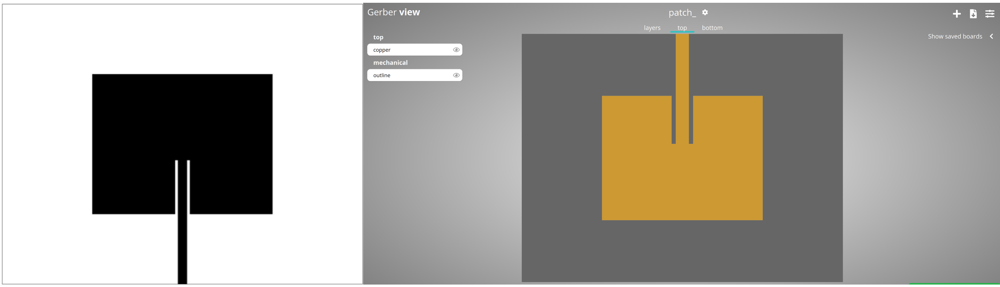
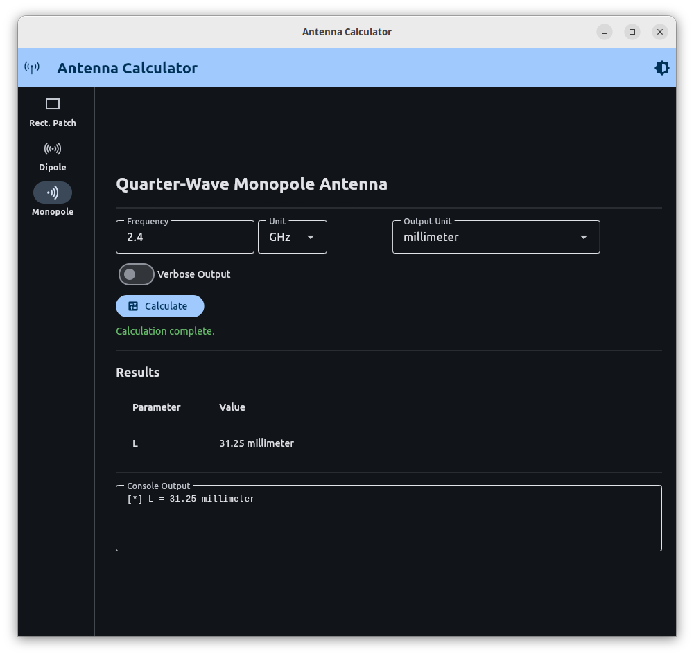

# Summary

AntennaCalculator is an open-source antenna design tool that computes physical dimensions for three common antenna topologies using analytical models: rectangular patch (probe-fed and microstrip-fed), half-wave dipole, and quarter-wave monopole [@Balanis]. It provides both a command-line interface and a cross-platform desktop GUI. For rectangular patch antennas, designs can be exported directly to fabrication-ready formats including Gerber, DXF, and PNG.

The calculated designs have been verified through simulation in Ansys HFSS and through physical construction and measurement with Keysight VNAs.

# Statement of Need

Antenna design typically requires either expensive commercial electromagnetic simulation tools such as Ansys HFSS, COMSOL, or CST Studio Suite, or manual calculations from textbook formulas. While these methods are broadly accepted, they do not address the barrier to entry for many hobbyists  and industry professionals in fields other than RF, nor do they address the need for a straightforward process. Online calculators exist for many topologies, but not all of them consider materials or impedance. For example, one drawback of typical rectangular patch antenna calculators is that they only output basic width and length dimensions. They do not compute the 50-ohm impedance match feed point location or the microstrip feed line width, which are necessary to connect and use the antenna. There is no existing open-source tool that combines complete analytical antenna design calculations with direct export to PCB fabrication formats.

The presented AntennaCalculator computes all parameters needed to construct a functioning antenna given a set of input specifications. With the half-wave dipole and quarter-wave monopole, the only required parameter is the frequency. For the more advanced rectangular patch design, the calculator considers the following: operating frequency, substrate permittivity, substrate height, and target impedance. Output calculations for rectangular patch antennas include the feed point location for both probe-fed and microstrip-fed configurations. The tool then exports the complete design in formats matched to different fabrication methods: PNG images for copper tape tracing or chemical etching, DXF files for CNC milling, and Gerber files for professional PCB manufacturing. These fabrication methods and their use in engineering education are discussed in [@PatchAntenna_ASEE] and [@SDR_Antenna_DEFCON].

The main contributions of AntennaCalculator are: (1) complete analytical antenna dimension calculations including impedance-matched feed point parameters; (2) direct export to multiple fabrication formats (PNG, DXF, Gerber), each supporting a different manufacturing method from low-cost copper tape to professional PCB production; (3) lowering the barrier to entry for antenna design in education and research by reducing the prerequisite knowledge needed to design and build a working antenna; and (4) both a CLI for scripting and automation, and a cross-platform desktop GUI for interactive use.

# State of the field

Commercial electromagnetic simulators such as Ansys HFSS, COMSOL, and CST Studio Suite provide accurate full-wave antenna analysis but impose substantial barriers to entry. High licensing costs and steep learning curves limit their use in broader education and resource-constrained research environments. Recent work to automate antenna design optimization within these tools has improved efficiency, yet users still require expensive licenses and electromagnetic expertise [@AntennaCAT_MAP]. While machine learning and deep learning approaches have accelerated antenna optimization and reduced the number of required simulations [@ML_DL_Antenna_Review], they still depend on access to the underlying commercial simulation infrastructure to verify designs.

Free online antenna calculators such as those on everythingRF [@everythingRF_calculator] offer an accessible alternative. These tools compute basic patch antenna width and length from operating frequency and substrate properties. However, they omit critical design parameters including the impedance-matched feed point location and microstrip feed line width. Without these parameters, constructing a functional antenna becomes difficult and prone to impedance mismatches and reflections.

Analytical antenna design methods form the foundation for rapid dimension calculation. Cavity resonator models and transmission line theory enable close estimation of rectangular patch antenna dimensions directly from substrate properties and frequency [@Microstrip_Antennas_IEEE]. Closed-form expressions also exist for feed point impedance, microstrip line width, and fringing length corrections [@Balanis]. Similarly, quarter-wave monopoles and half-wave dipoles follow simple geometric relationships. The fully analytical models of these topologies are well established, but no existing tool automates the calculations for all of these parameters with the intention of streamlining antenna manufacturing.

The critical gap lies in the combination of three requirements: complete analytical calculations that include feed parameters, direct export to formats used in fabrication, and open-source accessibility. Automated design tools like AntennaCAT generate design parameters within commercial simulation software suites [@AntennaCAT_MAP], and even incorporate the AntennaCalculator CLI model, but rely on simulation as a key factor of design and creation. Open-source electromagnetic simulation tools such as Python-based FEM frameworks can match commercial accuracy [@SlotAntenna_FEM_Python], yet address only the analysis phase, not fabrication export. 

The AntennaCalculator software bridges this gap by combining complete analytical antenna design, including feed point location and microstrip width, with direct export to multiple fabrication formats. The tool accepts operating frequency, substrate properties, substrate height, and target impedance as inputs, then outputs all parameters needed to construct a working antenna. PNG, DXF, and Gerber exports support fabrication methods ranging from low-cost copper tape and chemical etching to professional PCB manufacturing [@PatchAntenna_ASEE; @MicrostripPatch_LineFeed]. These varied fabrication pathways enable antenna construction across different cost and precision levels. 

# Software Design
AntennaCalculator uses a modular architecture that separates antenna calculations from fabrication output. Each antenna type is implemented as a standalone class: `RectangularPatch`, `Dipole`, and `Monopole`. Export functionality is handled by three independent generator classes: `PrintGenerator` produces 300 DPI letter-sized PNG images using Pillow, `DXFGenerator` creates DXF files using ezdxf, and `GerberGenerator` converts DXF layers to Gerber format using pcb-tools-extension. This separation allows new antenna types or export formats to be added independently. \autoref{fig:gui} shows the GUI with a microstrip patch antenna design.

The Gerber export uses a two-stage pipeline: `DXFGenerator` first creates a DXF with separate layers for the top copper and substrate outline, then `GerberGenerator` converts each layer to its corresponding Gerber file (`.gtl` for top layer, `.gml` for substrate). This reuses the DXF generator rather than duplicating geometry logic. \autoref{fig:exports} shows the PNG and Gerber fabrication outputs for a rectangular patch antenna.

All calculations are performed in SI units (meters). The Pint library handles unit conversions at I/O boundaries, keeping the calculation code unit-agnostic. The CLI uses argparse with subparsers for each antenna type. The GUI, built with Flet, constructs the same argument structures internally and dispatches to the same calculation classes, ensuring identical results between both interfaces.

The tool validates inputs before calculation. If the requested impedance exceeds the edge impedance of the patch, the calculator raises an error rather than returning a physically impossible design. The microstrip width calculation uses two complementary formulas (A-formula for $W_s/d < 2$, B-formula for $W_s/d > 2$) with automatic fallback, following the procedure in Balanis [@Balanis]. For impedance, AntennaCalculator defaults to 50 ohms, but any impedance value can be specified as an input parameter for the patch antenna calculations.   \autoref{fig:monopole} shows the GUI in dark mode with a quarter-wave monopole design.

# Research Impact Statement

AntennaCalculator has been used in peer-reviewed publications and has been presented at both academic and industry conferences. The tool and its fabrication methods were presented in [@PatchAntenna_ASEE]. The calculator has been integrated into AntennaCAT, an automated antenna design and tuning system for HFSS [@AntennaCAT_APS]. It was also presented at the DEF CON 30 RF Village introducing software defined radio users to custom antenna design and fabrication [@SDR_Antenna_DEFCON]. 

AntennaCalculator has been used in undergraduate and graduate level courses to provide students with introductory experience with antenna design. The fabrication export enables students to go from design parameters to a physical antenna in a single workflow. Feedback was incorporated from student use to streamline the user experience. 

# AI Usage Disclosure

All antenna calculations in AntennaCalculator are derived from established analytical formulas in Balanis [@Balanis] and verified against simulation and physical measurement. No generative AI tools were used in the development of the core calculation or export modules, or in the writing of this manuscript.

Claude Sonnet 4.5 (Anthropic) was used to assist with writing unit tests and configuring the GitHub Actions continuous integration pipeline. All AI-generated test cases were reviewed for correctness against known analytical results and expected software behavior before inclusion.

# References